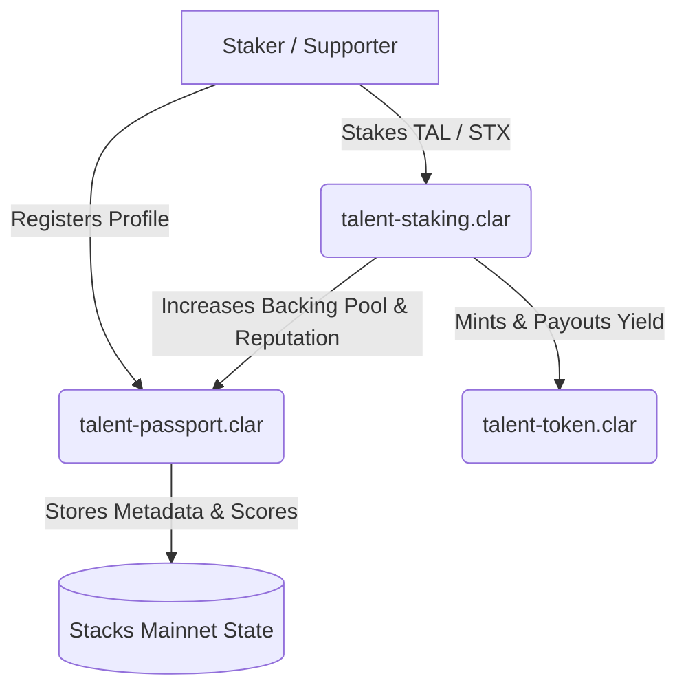

# 🪙 BitBacked: Bitcoin-Native Professional Reputation Protocol

BitBacked is a decentralized professional reputation and developer identity network built on the **Stacks Blockchain (Bitcoin Layer 2)**. Inspired by Talent Protocol, BitBacked allows builders to launch verifiable on-chain profiles ("Talent Passports") and enables supporters to stake utility tokens (`TAL`) to back them, increasing their reputation score and generating real-time yield.

---

## 📐 Architecture Overview

BitBacked leverages the security of Bitcoin and the smart contract versatility of Stacks (Clarity 2.0). The protocol is composed of three smart contracts and an interactive front-end application:



---

## 📄 Smart Contracts (Clarity)

### 1. `talent-passport.clar`
The central directory for professional developer identities.
*   **Profiles Map**: Stores structured profile details for Stacks addresses:
    *   `username`: Verifiable unique profile alias.
    *   `bio`: Description of core engineering and tech stacks.
    *   `avatar-url`: Remote reference link to avatar images.
    *   `github` & `twitter`: Linked developer social accounts.
    *   `reputation-score`: Numeric builder score (increases through verification and backing).
    *   `total-backing`: Aggregated volume of TAL tokens staked on this profile.
*   **Public Interfaces**:
    *   `(register-profile username bio avatar-url github twitter)`: Registers a new developer passport.
    *   `(update-profile bio avatar-url github twitter)`: Modifies profile metadata.
    *   `(verify-profile user status)`: Administrative function to grant verification badges (boosts reputation by 50 points).

### 2. `talent-token.clar`
A standard **SIP-010** fungible token representing the utility reputation currency `TAL`.
*   Supports typical ERC-20 equivalent operations like `transfer`, `mint`, and `burn`.
*   Includes metadata query functions standard to wallets (`get-name`, `get-symbol`, `get-decimals`, etc.).

### 3. `talent-staking.clar`
The yield-generating backing registry.
*   Supports staking TAL tokens to sponsor specific Stacks developers.
*   **Yield Formula**: Computes real-time yield rewards based on the staking duration and quantity. Staking 1 TAL token for 1 block generates `0.0001 TAL` (100 micro-TAL) in rewards (0.01% yield per block).
*   **Public Interfaces**:
    *   `(stake talent amount)`: Transfers TAL from the staker to the vault, increases the talent's reputation score and backing pool.
    *   `(unstake talent amount)`: Safely harvests pending rewards, returns TAL to the staker, and updates the talent's metrics.
    *   `(claim-rewards talent)`: Claims yield without modifying the staked balance.

---

## 🛠️ Mainnet Scripts

Located under the `scripts/` directory:
*   [deploy-mainnet.ts](file:///f:/stx%20june/scripts/deploy-mainnet.ts): Automates compiling, signing, and broadcasting the three contracts sequentially to Stacks Mainnet. Requires `STACKS_PRIVATE_KEY` env variable.
*   [interact-mainnet.ts](file:///f:/stx%20june/scripts/interact-mainnet.ts): Houses transaction builder functions for calling read-only and transaction-based methods on Mainnet.

---

## 💻 Local Quickstart

### Prerequisites
*   Node.js (v18 or higher)
*   npm

### Installation
Clone the repository and install all dependencies:
```bash
git clone https://github.com/Earnwithalee7890/bit-backed.git
cd bit-backed
npm install
```

### Running Tests
Execute the contract mock suite to verify all staking calculations and state logic:
```bash
npx ts-node src/tests/contracts-mock.test.ts
```

### Spin Up Dashboard
Run the local Vite development server to launch the glassmorphic React dashboard:
```bash
npm run dev
```
Open your browser to `http://localhost:5173`. Connect your mock wallet, claim test tokens from the faucet, and interact with the developer directory!

### Building for Production
Create an optimized production bundle:
```bash
npm run build
```

---

## 📜 License
This project is licensed under the MIT License.
